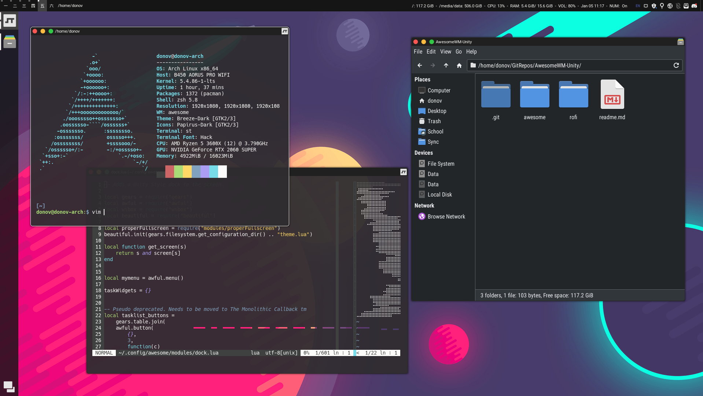

#AwesomeWM Unity

An attempt of mine to recreate something similar to the Ubuntu Unity workflow in AwesomeWM. This current build is stable enough for me to daily drive, but do bear in mind that it has a lot of issues at the moment that I still need to address.

#Installation

There is no install script yet, but both the awesome and rofi folders will go into your `~/.config` folder.

# TODO
- Remove Japanese Kanji from Workspace Names
- Remove any hardcoded path names
- Remove random notifications
- Clean up the extraneous files in both the awesome and rofi root directories
- Clean up some of the source files and add comments
